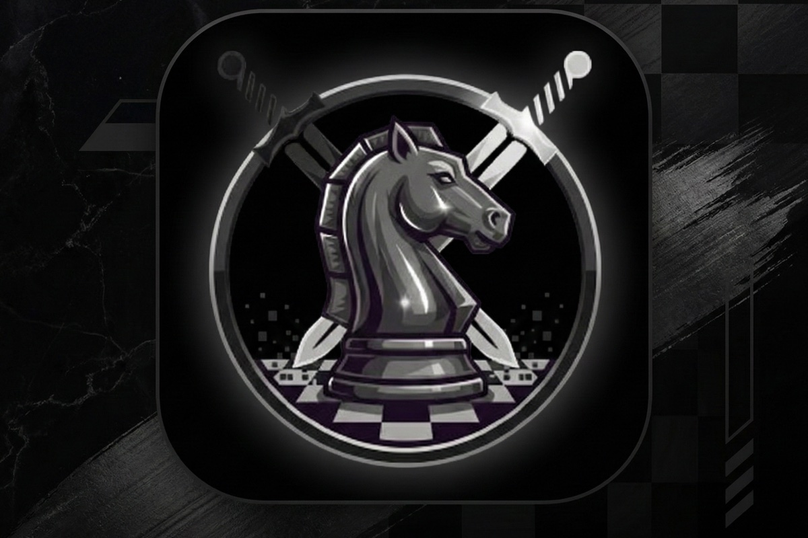

<div align="center">
  

  # ReplayChess

  **Master Chess Through Legendary Games**

  Replay iconic positions from the greatest chess games ever played. Inspired by Agadmator's "pause the video, find the best move" format — but interactive, competitive, and real-time.

  [](https://playchess.tech)

  
  
  
  
  
  
  

  
</div>

---

## What is ReplayChess?

Chess history has always been passive — videos, books, databases. You watch a legendary game, but you never *play* it.

ReplayChess changes that. Pick a famous game from chess history, start from the critical position, and try to find the same moves the legend played. Then see how your moves compare in post-game analysis.

- Play as **Bobby Fischer** in his immortal Game of the Century
- Replay **Kasparov vs. Deep Blue** from the decisive position
- Challenge friends to see who plays more like **Tal** under pressure

It's chess meets interactive history, with real-time multiplayer, ELO matchmaking, and browser-side Stockfish analysis.

---

## Features

### Core Gameplay
- **Play as a Legend** — Start from famous historical positions and try to match the legend's moves
- **Play from Openings** — ECO-coded openings encyclopedia; play from any opening position
- **Real-time Multiplayer** — Socket.IO matchmaking with ELO-based pairing and time controls
- **Challenge Friends** — Private invite links for head-to-head games
- **Play the Machine** — Browser-side Stockfish with four difficulty levels (easy, medium, hard, expert)

### Analysis & Learning
- **Post-game Analysis** — Compare your moves vs the legend's, match rate percentage, move-by-move navigation
- **Practice Mode** — Replay from any position against Stockfish after analysis
- **Divergence Detection** — See exactly where your moves diverged from the legend's line

### Content
- **Chess Legends Database** — Grouped by era, playing style, achievements, and famous games
- **Openings Encyclopedia** — ECO-coded (A–E groups), play from any opening position
- **Chess.com Integration** — Import your ratings and stats

### Platform
- **PWA** — Installable on mobile and desktop with offline support
- **Sound Design** — Distinct audio cues for moves, captures, checks, castling, game end, and time warnings
- **Sentry Tracing** — Distributed tracing across web and websocket for full game lifecycle visibility

---

## Tech Stack

| Technology | Version | Role |
|---|---|---|
| **Next.js** | 15.5 | App Router, SSR, API routes |
| **React** | 19.1 | UI with React Compiler (auto-memoization) |
| **Tailwind CSS** | 4.x | Styling |
| **Motion** | 12.x | Animations (framer-motion) |
| **Socket.IO** | 4.8 | Real-time multiplayer |
| **chess.js** | 1.4 | Board logic and move validation |
| **Stockfish.js** | 10.0 | Browser-side AI engine |
| **PostgreSQL + Prisma** | 6.17 | Database and ORM |
| **Clerk** | 6.33 | Authentication |
| **Sentry** | 10.38 | Error tracking and distributed tracing |
| **Zustand** | 5.0 | Client state management |
| **Zod** | 4.1 | Schema validation |
| **Docker** | — | Containerized deployment |

---

## Architecture

```
┌──────────────────────────────────────────────────────────────┐
│                        Client (Browser)                       │
│  Next.js App (React 19 + Compiler) ──── Stockfish.js (WASM)  │
└───────────────┬──────────────────────────────┬───────────────┘
                │ HTTP/SSR                     │ WebSocket
                ▼                              ▼
┌───────────────────────┐      ┌───────────────────────────────┐
│    apps/web            │ ◄──►│     apps/web-socket            │
│    Next.js 15          │ HTTP│     Express + Socket.IO        │
│    API Routes          │     │     GameManager                │
│    Prisma ORM          │     │     GameSession (per game)     │
│    Clerk Auth          │     │     ClockManager (per game)    │
└───────────┬────────────┘     └───────────────────────────────┘
            │
            ▼
┌───────────────────────┐
│     PostgreSQL         │
│     (Neon / local)     │
└────────────────────────┘
```

**Key design decisions:**
- The WebSocket server is **database-free** — all DB operations go through HTTP calls to the web app
- Matchmaking uses `FOR UPDATE SKIP LOCKED` for lock-free, concurrent queue processing
- React Compiler handles all memoization — no manual `React.memo`, `useMemo`, or `useCallback`

### Socket Event Flow

```
Client                    Server
  │                         │
  ├── join_game ──────────► │
  │                         ├── waiting_for_opponent
  │                         ├── analysis_phase_started
  │                         ├── analysis_tick (countdown)
  │                         ├── game_started
  │                         │
  ├── make_move ──────────► │
  │                         ├── move_made
  │                         ├── clock_update
  │                         │
  ├── resign / offer_draw ► │
  │                         ├── game_over
  │                         │
```

---

## Getting Started

### Prerequisites

- **Node.js** >= 22
- **pnpm** >= 9
- **PostgreSQL** (local or hosted, e.g. Neon)

### Setup

```bash
# Clone
git clone https://github.com/your-username/chess-battle-turbo.git
cd chess-battle-turbo

# Install dependencies
pnpm install

# Set up environment variables (see Environment Variables section below)
cp apps/web-socket/.env.example apps/web-socket/.env
# Create apps/web/.env.local with required variables

# Generate Prisma client and run migrations
pnpm --filter web prisma:generate
pnpm --filter web prisma:migrate:deploy

# Seed the database
pnpm --filter web prisma:seed
pnpm --filter web prisma:seed:openings

# Start development servers
pnpm dev
```

This starts:
- **Web app** on `http://localhost:3000`
- **WebSocket server** on `http://localhost:3002`

### Docker Alternative

```bash
docker-compose up
```

Runs both services with internal networking. The WebSocket server communicates with the web app via Docker's internal network.

---

## Project Structure

```
chess-battle-turbo/
├── apps/
│   ├── web/                          # Next.js 15 application
│   │   ├── app/
│   │   │   ├── page.tsx              # Landing page
│   │   │   ├── play/                 # Game creation (modes, legends, openings)
│   │   │   ├── queue/                # Matchmaking queue
│   │   │   ├── game/[gameId]/        # Live game + sub-components
│   │   │   ├── analysis/[gameId]/    # Post-game analysis
│   │   │   ├── legends/              # Legends database
│   │   │   ├── openings/             # Openings encyclopedia
│   │   │   ├── join/[gameReferenceId]/ # Private game invite
│   │   │   └── api/                  # API routes
│   │   │       ├── chess/            # Game CRUD, moves, AI games
│   │   │       ├── matchmaking/      # Queue management
│   │   │       ├── analysis/         # Post-game analysis data
│   │   │       ├── legends/          # Legends CRUD + search
│   │   │       ├── openings/         # Openings data
│   │   │       ├── chess-positions/  # Historical positions
│   │   │       ├── user/             # User sync, profiles, Chess.com
│   │   │       └── scraper/          # Position import (API key auth)
│   │   ├── components/               # Shared UI components
│   │   ├── lib/
│   │   │   ├── hooks/                # Custom hooks
│   │   │   ├── stores/               # Zustand stores
│   │   │   ├── types/                # TypeScript types
│   │   │   └── prisma.ts             # Prisma singleton
│   │   └── prisma/
│   │       └── schema.prisma         # Database schema
│   │
│   └── web-socket/                   # Socket.IO game server
│       ├── index.ts                  # Express + Socket.IO setup
│       ├── GameManager.ts            # Orchestrates all games
│       ├── GameSession.ts            # Individual game state
│       ├── ClockManager.ts           # Per-game timer management
│       └── types.ts                  # Socket event payloads
│
├── packages/
│   ├── eslint-config/                # Shared ESLint configs
│   ├── typescript-config/            # Shared tsconfig
│   └── ui/                           # Shared component library
│
├── docker-compose.yml
├── turbo.json
└── pnpm-workspace.yaml
```

---

## Environment Variables

### `apps/web/.env.local`

| Variable | Description |
|---|---|
| `DATABASE_URL` | PostgreSQL connection string |
| `NEXT_PUBLIC_CLERK_PUBLISHABLE_KEY` | Clerk publishable key |
| `CLERK_SECRET_KEY` | Clerk secret key |
| `NEXT_PUBLIC_CLERK_SIGN_IN_URL` | Sign-in redirect path (e.g. `/sign-in`) |
| `NEXT_PUBLIC_WEBSOCKET_URL` | WebSocket server URL (e.g. `ws://localhost:3002`) |
| `NEXT_PUBLIC_SENTRY_DSN` | Sentry DSN for error tracking |
| `SENTRY_AUTH_TOKEN` | Sentry auth token (build-time, for source maps) |
| `SCRAPER_API_KEY` | API key for `/api/scraper/*` routes |

### `apps/web-socket/.env`

| Variable | Description |
|---|---|
| `PORT` | Server port (default: `3002`) |
| `NODE_ENV` | Environment (`development` / `production`) |
| `WEB_APP_URL` | Web app URL for HTTP API calls (e.g. `http://localhost:3000`) |

---

## Database Schema

Key models in the Prisma schema:

| Model | Purpose |
|---|---|
| `User` | Player accounts (synced from Clerk) |
| `Game` | Game records with FEN, moves, results |
| `Legend` | Chess legends (era, style, achievements, famous games) |
| `Opening` | ECO-coded chess openings |
| `ChessPosition` | Historical positions from legendary games |
| `MatchmakingQueue` | Real-time matchmaking queue |
| `UserStats` | Player statistics and ELO rating |
| `ChessComProfile` | Imported Chess.com ratings |
| `Wallet` | Player wallet balance |
| `Transaction` | Wallet transaction history |

Enums: `GameStatus`, `GameResult`, `MatchmakingStatus`, `TransactionType`, `TransactionStatus`

---

## Deployment

| Component | Platform | Trigger |
|---|---|---|
| **Web** | Vercel | Auto-deploy from `main` |
| **WebSocket** | AWS EC2 | GitHub Actions on `apps/web-socket/**` changes |
| **Database** | Neon PostgreSQL | Managed |

Docker images are available for self-hosting:
- `sasuke0007/replay-chess-web`
- `sasuke0007/replay-chess-websocket`

---

## Scripts Reference

```bash
pnpm dev                              # Run all apps in development
pnpm --filter web dev                 # Web app only (port 3000)
pnpm --filter web-socket dev          # WebSocket server only (port 3002)
pnpm --filter web build               # Production build (runs prisma generate)
pnpm --filter web check-types         # TypeScript type checking
pnpm --filter web lint                # ESLint (zero warnings)
pnpm format                           # Prettier across repo
pnpm --filter web prisma:generate     # Generate Prisma client
pnpm --filter web prisma:migrate:deploy  # Run migrations
pnpm --filter web prisma:seed         # Seed database
pnpm --filter web prisma:seed:openings   # Seed openings data
```

---

<div align="center">

**[playchess.tech](https://playchess.tech)**

Built by [Rohit Pandit](https://github.com/sasuke0007)

</div>
